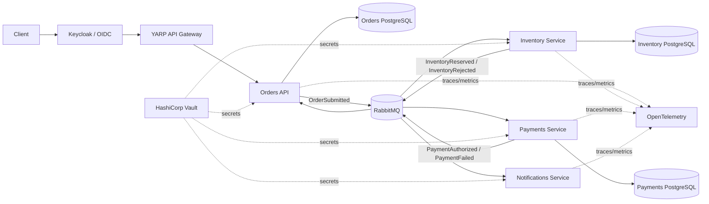

<div align="center">

[🇧🇷 Português](README.md)

# Distributed Commerce Platform

### .NET 10 · Aspire · Clean Architecture · YARP · RabbitMQ · Keycloak · Vault · OpenTelemetry · AI Engineering Harness

[](https://github.com/WillianZanutoOliveira/distributed-commerce-platform/actions/workflows/ci.yml)


**[Architecture](docs/architecture.en.md) · [Local development](docs/local-development.en.md) · [5-minute Recruiter Walkthrough](docs/recruiter-guide.en.md) · [ADRs](docs/adr) · [Kubernetes](deploy/k8s/README.en.md) · [CI](https://github.com/WillianZanutoOliveira/distributed-commerce-platform/actions/workflows/ci.yml)**

</div>

A production-minded distributed commerce reference platform designed to demonstrate the engineering concerns expected in **Senior .NET, Tech Lead and Software Architect** roles.

The system models a checkout flow split across independently deployable services:

1. **Orders API** receives an order and persists the aggregate.
2. The order is published through a **transactional bus outbox**.
3. **Inventory Service** consumes the order, makes an idempotent reservation decision and publishes the result.
4. **Payments Service** reacts to a successful reservation and authorizes or rejects the payment.
5. **Orders** reacts asynchronously to the final business outcome.
6. **Notifications Service** consumes payment outcomes independently.

The project intentionally focuses on the hard parts of distributed systems rather than on UI work.

---

## Why this project exists

The goal is to make advanced backend engineering visible in a public portfolio:

- Clean Architecture and dependency inversion;
- domain modeling and aggregate invariants;
- asynchronous messaging with RabbitMQ;
- event-driven service collaboration;
- transactional outbox/inbox patterns with MassTransit + EF Core;
- idempotent message processing;
- eventual consistency;
- retries and failure isolation;
- database-per-service;
- PostgreSQL;
- YARP API Gateway with edge authentication and identity-partitioned rate limiting;
- centralized secrets management with HashiCorp Vault and per-workload policies;
- dynamic PostgreSQL credentials through the Database Secrets Engine with TTL, lease renewal and revocation;
- OpenTelemetry traces/metrics with Tempo, Prometheus and Grafana;
- Docker and Docker Compose;
- local orchestration with .NET Aspire 13.6 and its integrated dashboard;
- shared Service Defaults for readiness/liveness, service discovery and HTTP resilience;
- Kubernetes-ready health endpoints;
- CI/CD quality gates;
- weekly k6 performance baseline with technical-SLO thresholds;
- automated tests, coverage and real PostgreSQL integration through Testcontainers;
- Clean Code enforcement with SonarAnalyzer, .editorconfig and dotnet format;
- DevSecOps gates with CodeQL, Trivy, SBOM generation and OpenSSF Scorecard;
- commit-pinned GitHub Actions and GHCR OCI releases with OIDC/Sigstore provenance attestations;
- OpenID Connect authentication, JWT validation, RBAC and resource-level authorization with Keycloak;
- native ASP.NET Core OpenAPI validated by the Aspire topology test;
- AI-assisted engineering harness with build/test gates and pull-request-only delivery;
- architecture decision records.

---

## Architecture



More detail: [Architecture documentation](docs/architecture.en.md) · [5-minute recruiter walkthrough](docs/recruiter-guide.en.md)

---

## Service boundaries

| Service | Responsibility | Persistence | Messaging |
| --- | --- | --- | --- |
| Orders API | order lifecycle and customer-facing API | PostgreSQL | publish + consume |
| Inventory Service | inventory reservation decision | PostgreSQL | consume + publish |
| Payments Service | payment authorization decision | PostgreSQL | consume + publish |
| Notifications Service | independent customer communication reaction | stateless demo | consume |

Each stateful service owns its own database. No service reads another service's tables.

---

## Clean Architecture

The **Orders** bounded context is split into explicit layers:

```text
Orders.Domain
      ↑
Orders.Application
      ↑
Orders.Infrastructure
      ↑
Orders.Api
```

The domain knows nothing about EF Core, RabbitMQ or ASP.NET Core.

The application layer depends on ports such as:

- `IOrderRepository`
- `IUnitOfWork`
- `IIntegrationEventPublisher`

Infrastructure implements those ports with PostgreSQL, EF Core and MassTransit.

Smaller event-only services use a deliberately lighter structure. This is intentional: the project demonstrates that architecture should match service complexity rather than copy layers mechanically.

---

## Reliability patterns

### Transactional outbox

The Orders API uses the MassTransit EF Core **Bus Outbox**.

The order state and the outgoing `OrderSubmitted` message participate in the same persistence boundary. The HTTP request does not need a distributed transaction between PostgreSQL and RabbitMQ.

### Consumer inbox/outbox

Inventory, Payments and Orders consumers use the EF Core outbox integration to support duplicate protection and reliable outgoing messages.

### Idempotency

Inventory and Payments persist a unique decision per `OrderId` so repeated business events do not create duplicate reservations or payments.

### Eventual consistency

The API returns an order in `Pending` state first. The state becomes `Completed`, `InventoryRejected` or `PaymentFailed` asynchronously.

This is a deliberate distributed-system trade-off.

---

## Event flow

```text
POST /orders
      |
      v
OrderSubmitted
      |
      v
Inventory Service
   /       \
  v         v
Reserved   Rejected
  |          |
  v          +------------------> Orders -> InventoryRejected
Payments
 /    \
v      v
Paid  Failed
 |      |
 +------+-----------------------> Orders
 |
 +------------------------------> Notifications
```

---

## Running locally

### Recommended path: .NET Aspire

Requirements:

- .NET 10 SDK;
- Docker or an Aspire-compatible Podman installation.

Start the complete platform with one command:

```bash
dotnet run --project src/Platform/DistributedCommerce.AppHost
```

The AppHost starts PostgreSQL, RabbitMQ, Keycloak and Vault, bootstraps dynamic credentials, launches the Gateway + four services as local projects and opens the Aspire Dashboard for logs, traces, metrics, endpoints and resource state.

Local infrastructure passwords are generated through the Aspire secret store. Workload-scoped Vault tokens are written only under `.aspire/vault-tokens`, which is excluded from Git.

See the [local-development guide](docs/local-development.en.md) and [ADR-0008](docs/adr/0008-dotnet-aspire-local-orchestration.en.md).

### Parity / CI path: Docker Compose

Secure Compose remains supported and is still exercised by CI:

```bash
cp .env.example .env
docker compose -f docker-compose.yml -f docker-compose.vault.yml up --build
```

The simple `docker-compose.yml` remains useful for learning, while the Vault overlay preserves dynamic PostgreSQL credentials.

Endpoints:

| Component | URL |
| --- | --- |
| API Gateway | http://localhost:8080 |
| Orders API | http://localhost:8081 |
| Orders health | http://localhost:8081/health |
| Inventory health | http://localhost:8082/health |
| Payments health | http://localhost:8083/health |
| Notifications health | http://localhost:8084/health |
| RabbitMQ Management | http://localhost:15672 |
| Keycloak | http://localhost:8180 |
| Vault | http://localhost:8200 |
| Grafana | http://localhost:3000 |
| Prometheus | http://localhost:9090 |
| Tempo | http://localhost:3200 |

Get a token for the local demo user:

```bash
TOKEN=$(curl -s -X POST http://localhost:8180/realms/distributed-commerce/protocol/openid-connect/token \
  -H "Content-Type: application/x-www-form-urlencoded" \
  -d "grant_type=password" \
  -d "client_id=commerce-cli" \
  -d "username=demo-customer" \
  -d "password=local-demo-only" | jq -r .access_token)
```

Create an authenticated order. CustomerId is derived from the token sub claim and is not accepted from the payload:

```bash
curl -X POST http://localhost:8080/api/orders \
  -H "Authorization: Bearer $TOKEN" \
  -H "Content-Type: application/json" \
  -d '{
    "items": [
      { "sku": "NOTEBOOK-01", "quantity": 1, "unitPrice": 3499.90 }
    ]
  }'
```

Query its asynchronous status:

```bash
curl http://localhost:8080/api/orders/{order-id} \
  -H "Authorization: Bearer $TOKEN"
```

### Demo failure paths

The sample contains deterministic policies so the distributed flow can be tested without external providers:

- an item quantity above **10** produces `InventoryRejected`;
- an order total above **5,000** produces `PaymentFailed`.

These rules are intentionally simple; the architecture around them is the focus.

---

## Security and identity

The Orders API validates access tokens issued by Keycloak. Signature, issuer, audience and lifetime are validated, and realm roles feed authorization policies.

Order CustomerId is derived from the token sub claim instead of trusting the request payload. Users with the customer role can only read their own orders, while admin can read across customers.

The versioned local realm exists for demos and smoke tests. Direct password grant is only a local fixture; real interactive clients should use Authorization Code + PKCE.

See [ADR-0004](docs/adr/0004-identity-keycloak.en.md).

### Secrets vault

The secure profile uses two Vault layers. RabbitMQ remains in KV v2, while PostgreSQL uses the Database Secrets Engine: Orders, Inventory and Payments receive a unique temporary login with TTL and a renewable lease. Each workload receives its own file-mounted Vault token and can only read/renew paths associated with that identity.

The PostgreSQL connection string is built only in memory. `ConnectionStrings__*-db` remains empty in the container environment, and the host terminates if the lease cannot be renewed — a fail-closed posture.

Production does not use dev mode/root tokens: prefer platform identity (for example Kubernetes Auth), short-lived tokens, TLS, auditing and a dedicated Vault database-administration identity. See [secrets management](docs/secrets-management.en.md), [ADR-0006](docs/adr/0006-secrets-hashicorp-vault.en.md) and [ADR-0007](docs/adr/0007-dynamic-postgresql-credentials.en.md).

---

## Database migrations and least privilege

Schema creation no longer belongs to application runtime. Orders, Inventory and Payments have committed **EF Core Migrations** plus a one-shot `DatabaseMigrator`.

The identity split is explicit:

```text
Vault <service>-migration -> temporary login -> <service>_migrator -> DDL
Vault <service>-app       -> temporary login -> <service>_runtime  -> DML only
```

Compose and Aspire wait for migration completion before starting the workload. The Kubernetes/GitOps model executes the same migrator as an Argo CD `PreSync` Job. CI fails if `EnsureCreatedAsync` returns or if runtime regains schema `CREATE`.

See [ADR-0011](docs/adr/0011-ef-migrations-vault-deployment-identity.en.md).

---

## Service Defaults and edge protection

All workloads use a shared Aspire-aligned building block:

- `/health` for readiness;
- `/alive` for liveness;
- shared OpenTelemetry;
- service discovery;
- Standard Resilience Handler for future `HttpClient` usage.

The YARP Gateway applies token-bucket rate limiting per authenticated subject with an IP fallback. Orders exposes `/openapi/v1.json` in Development, and the Aspire topology test validates that document automatically.

See [ADR-0009](docs/adr/0009-service-defaults-api-resilience.en.md).

---

## Software supply chain

Beyond CodeQL, Trivy and SBOM generation, the repository automates:

- weekly OpenSSF Scorecard with SARIF/Code Scanning results;
- immutable-SHA GitHub Action references;
- `CODEOWNERS` and `SECURITY.md`;
- automatic publishing of six OCI images to GHCR on `v*` tags;
- cryptographic provenance attestation for each OCI digest through GitHub OIDC + Sigstore.

Example release:

```bash
git tag v1.0.0
git push origin v1.0.0
```

Published image provenance can then be verified with `gh attestation verify`.

See [ADR-0010](docs/adr/0010-software-supply-chain.en.md).

---

## AI Engineering Harness

The repository also demonstrates development-cycle automation. The [AI Evolution Harness](.github/workflows/ai-evolution.yml) runs a Codex agent under versioned rules in [AGENTS.md](AGENTS.md) and [.ai/engineering-constitution.md](.ai/engineering-constitution.md).

The agent can implement a small task, but delivery only happens after restore, build, tests and Compose validation. Output is always a branch and pull request for human review; there is no auto-merge.

See [ADR-0005](docs/adr/0005-ai-engineering-harness.en.md).

---

## Observability

All services use a shared OpenTelemetry building block. In the Aspire inner loop, the Dashboard aggregates resources, logs, traces and metrics. Docker Compose still includes OpenTelemetry Collector, Tempo, Prometheus and Grafana to demonstrate observability independently from Aspire, through:

- `ActivitySource` for distributed trace spans;
- custom message-processing metrics;
- OTLP export when `OTEL_EXPORTER_OTLP_ENDPOINT` is configured;
- console export as the local fallback.

This keeps telemetry vendor-neutral.

---

## CI/CD

GitHub Actions validates every relevant change with:

1. dependency restore;
2. Release build;
3. explicit .NET Aspire AppHost validation;
4. automated tests;
5. code-coverage collection;
6. Sonar/.editorconfig/dotnet format quality gate;
7. Testcontainers integration tests;
8. API Gateway container build;
9. Orders container build;
10. Inventory container build;
11. Payments container build;
12. Notifications container build;
13. real Gateway + Keycloak + Vault smoke testing;
14. real dynamic PostgreSQL identity, environment isolation and lease-renewal verification;
15. CodeQL, Trivy and SPDX SBOM security gates.

Dependabot monitors NuGet and GitHub Actions dependencies.

---

## Architecture, contract and chaos tests

Executable quality gates protect properties beyond ordinary unit tests:

- **Architecture Tests** block forbidden dependencies across layers and bounded contexts;
- **Contract Compatibility Tests** guard the public shape of published integration events;
- **Chaos Tests** use Testcontainers + Toxiproxy to cut and restore PostgreSQL connectivity and assert failure/recovery.

See [ADR-0012](docs/adr/0012-architecture-contract-chaos-gitops.en.md).

---

## GitOps and canary delivery

`deploy/gitops` demonstrates **Argo CD + Argo Rollouts + Vault Kubernetes Auth**:

```text
v* tag
  -> GHCR images/attestations
  -> GitOps Promotion opens PR
  -> review + merge
  -> Argo CD PreSync migration
  -> 20% canary -> analysis -> 50% -> analysis -> 100%
```

CI never imperatively deploys production. Git is the source of truth and the promotion workflow never auto-merges.

See the [GitOps guide](deploy/gitops/README.en.md) and [ADR-0012](docs/adr/0012-architecture-contract-chaos-gitops.en.md).

---

## Performance baseline

The [Performance Baseline](.github/workflows/performance.yml) workflow runs k6 weekly or on demand against Orders using the secure Keycloak/Vault/PostgreSQL/RabbitMQ stack.

The baseline fails when HTTP errors reach 1%, fewer than 99% of order creations return HTTP 201, or p95 latency exceeds one second. This detects regressions without slowing every pull request.

See the [performance documentation](docs/performance.en.md).

---

## Kubernetes

The repository includes Kubernetes-oriented deployment examples under [deploy/k8s](deploy/k8s/README.en.md).

They demonstrate:

- liveness and readiness probes;
- resource requests and limits;
- ConfigMap/Secret separation;
- independently scalable services;
- stateless application containers.

RabbitMQ and PostgreSQL are treated as platform dependencies that would normally be provided through managed services or dedicated operators in production.

---

## Architecture decisions

- [ADR-0001 — Event-driven services and Clean Architecture](docs/adr/0001-event-driven-clean-architecture.md)
- [ADR-0002 — Transactional outbox instead of distributed transactions](docs/adr/0002-transactional-outbox.md)
- [ADR-0003 — Idempotency and eventual consistency](docs/adr/0003-idempotency-eventual-consistency.md)
- [ADR-0004 — Identity and authorization with Keycloak](docs/adr/0004-identity-keycloak.en.md)
- [ADR-0005 — AI-assisted engineering harness](docs/adr/0005-ai-engineering-harness.en.md)
- [ADR-0006 — Centralized secrets management with HashiCorp Vault](docs/adr/0006-secrets-hashicorp-vault.en.md)
- [ADR-0007 — Dynamic PostgreSQL credentials with Vault Database Secrets Engine](docs/adr/0007-dynamic-postgresql-credentials.en.md)
- [ADR-0008 — .NET Aspire as the local development orchestrator](docs/adr/0008-dotnet-aspire-local-orchestration.en.md)
- [ADR-0009 — Service Defaults, health model, OpenAPI and edge protection](docs/adr/0009-service-defaults-api-resilience.en.md)
- [ADR-0010 — Software supply chain and attested releases](docs/adr/0010-software-supply-chain.en.md)
- [ADR-0011 — EF Core Migrations with a separate Vault deployment identity](docs/adr/0011-ef-migrations-vault-deployment-identity.en.md)
- [ADR-0012 — Architecture guardrails, contracts, fault injection and progressive delivery](docs/adr/0012-architecture-contract-chaos-gitops.en.md)

---

## Repository structure

```text
src/
├── BuildingBlocks/
│   ├── Contracts/
│   ├── Observability/
│   ├── Security/
│   └── Secrets/
├── Gateway/
│   └── ApiGateway/
├── Platform/
│   ├── DistributedCommerce.AppHost/
│   └── DatabaseMigrator/
└── Services/
    ├── Orders/
    │   ├── Orders.Domain/
    │   ├── Orders.Application/
    │   ├── Orders.Infrastructure/
    │   └── Orders.Api/
    ├── Inventory/
    ├── Payments/
    └── Notifications/

tests/
├── Architecture.Tests/
├── Chaos.Tests/
├── Contracts.Compatibility.Tests/
├── DistributedCommerce.AppHost.Tests/
├── Orders.Domain.Tests/
└── Orders.Persistence.IntegrationTests/

docs/
├── architecture.md
└── adr/

deploy/
└── k8s/
```

---

## Engineering trade-offs

This is a portfolio/reference implementation, not a claim that every system should use microservices.

A modular monolith would be preferable for many smaller products. This project uses distributed services intentionally to make visible the concerns that only appear when boundaries are separated: delivery guarantees, idempotency, asynchronous state transitions, independent persistence, retry policy, operational health and observability.

That trade-off is documented rather than hidden.
