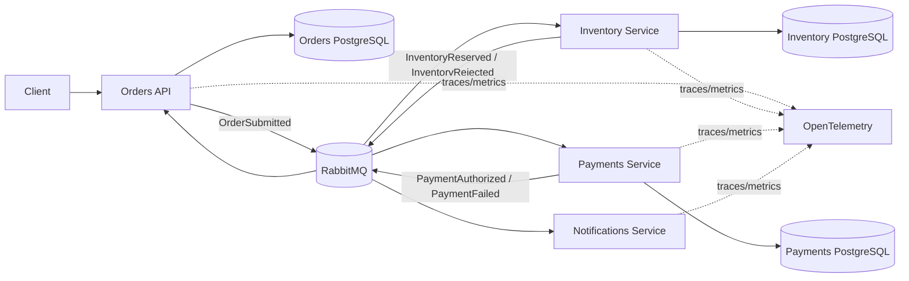

<div align="center">

[🇧🇷 Português](README.md)

# Distributed Commerce Platform

### .NET 10 · Clean Architecture · RabbitMQ · Event-Driven Architecture

[](https://github.com/WillianZanutoOliveira/distributed-commerce-platform/actions/workflows/ci.yml)


**[Architecture](docs/architecture.en.md) · [5-minute Recruiter Walkthrough](docs/recruiter-guide.en.md) · [ADRs](docs/adr) · [Kubernetes](deploy/k8s/README.en.md) · [CI](https://github.com/WillianZanutoOliveira/distributed-commerce-platform/actions/workflows/ci.yml)**

</div>

A production-minded distributed commerce reference platform designed to demonstrate the engineering concerns expected in **Senior .NET, Tech Lead and Software Architect** roles.

The system models a checkout flow split across independently deployable services:

1. **Orders API** receives an order and persists the aggregate.
2. The order is published through a **transactional bus outbox**.
3. **Inventory Service** consumes the order, makes an idempotent reservation decision and publishes the result.
4. **Payments Service** reacts to a successful reservation and authorizes or rejects the payment.
5. **Orders** reacts asynchronously to the final business outcome.
6. **Notifications Service** consumes payment outcomes independently.

The project intentionally focuses on the hard parts of distributed systems rather than on UI work.

---

## Why this project exists

The goal is to make advanced backend engineering visible in a public portfolio:

- Clean Architecture and dependency inversion;
- domain modeling and aggregate invariants;
- asynchronous messaging with RabbitMQ;
- event-driven service collaboration;
- transactional outbox/inbox patterns with MassTransit + EF Core;
- idempotent message processing;
- eventual consistency;
- retries and failure isolation;
- database-per-service;
- PostgreSQL;
- OpenTelemetry traces and metrics;
- Docker and Docker Compose;
- Kubernetes-ready health endpoints;
- CI/CD quality gates;
- automated tests and coverage;
- architecture decision records.

---

## Architecture



More detail: [Architecture documentation](docs/architecture.en.md) · [5-minute recruiter walkthrough](docs/recruiter-guide.en.md)

---

## Service boundaries

| Service | Responsibility | Persistence | Messaging |
| --- | --- | --- | --- |
| Orders API | order lifecycle and customer-facing API | PostgreSQL | publish + consume |
| Inventory Service | inventory reservation decision | PostgreSQL | consume + publish |
| Payments Service | payment authorization decision | PostgreSQL | consume + publish |
| Notifications Service | independent customer communication reaction | stateless demo | consume |

Each stateful service owns its own database. No service reads another service's tables.

---

## Clean Architecture

The **Orders** bounded context is split into explicit layers:

```text
Orders.Domain
      ↑
Orders.Application
      ↑
Orders.Infrastructure
      ↑
Orders.Api
```

The domain knows nothing about EF Core, RabbitMQ or ASP.NET Core.

The application layer depends on ports such as:

- `IOrderRepository`
- `IUnitOfWork`
- `IIntegrationEventPublisher`

Infrastructure implements those ports with PostgreSQL, EF Core and MassTransit.

Smaller event-only services use a deliberately lighter structure. This is intentional: the project demonstrates that architecture should match service complexity rather than copy layers mechanically.

---

## Reliability patterns

### Transactional outbox

The Orders API uses the MassTransit EF Core **Bus Outbox**.

The order state and the outgoing `OrderSubmitted` message participate in the same persistence boundary. The HTTP request does not need a distributed transaction between PostgreSQL and RabbitMQ.

### Consumer inbox/outbox

Inventory, Payments and Orders consumers use the EF Core outbox integration to support duplicate protection and reliable outgoing messages.

### Idempotency

Inventory and Payments persist a unique decision per `OrderId` so repeated business events do not create duplicate reservations or payments.

### Eventual consistency

The API returns an order in `Pending` state first. The state becomes `Completed`, `InventoryRejected` or `PaymentFailed` asynchronously.

This is a deliberate distributed-system trade-off.

---

## Event flow

```text
POST /orders
      |
      v
OrderSubmitted
      |
      v
Inventory Service
   /       \
  v         v
Reserved   Rejected
  |          |
  v          +------------------> Orders -> InventoryRejected
Payments
 /    \
v      v
Paid  Failed
 |      |
 +------+-----------------------> Orders
 |
 +------------------------------> Notifications
```

---

## Running locally

### Requirements

- Docker Desktop / Docker Engine
- Docker Compose

Create the local secret file:

```bash
cp .env.example .env
```

Change the example passwords and run:

```bash
docker compose up --build
```

Endpoints:

| Component | URL |
| --- | --- |
| Orders API | http://localhost:8081 |
| Orders health | http://localhost:8081/health |
| Inventory health | http://localhost:8082/health |
| Payments health | http://localhost:8083/health |
| Notifications health | http://localhost:8084/health |
| RabbitMQ Management | http://localhost:15672 |

Create an order:

```bash
curl -X POST http://localhost:8081/orders \
  -H "Content-Type: application/json" \
  -d '{
    "customerId": "customer-001",
    "items": [
      { "sku": "NOTEBOOK-01", "quantity": 1, "unitPrice": 3499.90 }
    ]
  }'
```

Query its asynchronous status:

```bash
curl http://localhost:8081/orders/{order-id}
```

### Demo failure paths

The sample contains deterministic policies so the distributed flow can be tested without external providers:

- an item quantity above **10** produces `InventoryRejected`;
- an order total above **5,000** produces `PaymentFailed`.

These rules are intentionally simple; the architecture around them is the focus.

---

## Observability

All services use a shared OpenTelemetry building block with:

- `ActivitySource` for distributed trace spans;
- custom message-processing metrics;
- OTLP export when `OTEL_EXPORTER_OTLP_ENDPOINT` is configured;
- console export as the local fallback.

This keeps telemetry vendor-neutral.

---

## CI/CD

GitHub Actions validates every relevant change with:

1. dependency restore;
2. Release build;
3. automated tests;
4. code-coverage collection;
5. Orders container build;
6. Inventory container build;
7. Payments container build;
8. Notifications container build.

Dependabot monitors NuGet and GitHub Actions dependencies.

---

## Kubernetes

The repository includes Kubernetes-oriented deployment examples under [deploy/k8s](deploy/k8s/README.en.md).

They demonstrate:

- liveness and readiness probes;
- resource requests and limits;
- ConfigMap/Secret separation;
- independently scalable services;
- stateless application containers.

RabbitMQ and PostgreSQL are treated as platform dependencies that would normally be provided through managed services or dedicated operators in production.

---

## Architecture decisions

- [ADR-0001 — Event-driven services and Clean Architecture](docs/adr/0001-event-driven-clean-architecture.md)
- [ADR-0002 — Transactional outbox instead of distributed transactions](docs/adr/0002-transactional-outbox.md)
- [ADR-0003 — Idempotency and eventual consistency](docs/adr/0003-idempotency-eventual-consistency.md)

---

## Repository structure

```text
src/
├── BuildingBlocks/
│   ├── Contracts/
│   └── Observability/
└── Services/
    ├── Orders/
    │   ├── Orders.Domain/
    │   ├── Orders.Application/
    │   ├── Orders.Infrastructure/
    │   └── Orders.Api/
    ├── Inventory/
    ├── Payments/
    └── Notifications/

tests/
└── Orders.Domain.Tests/

docs/
├── architecture.md
└── adr/

deploy/
└── k8s/
```

---

## Engineering trade-offs

This is a portfolio/reference implementation, not a claim that every system should use microservices.

A modular monolith would be preferable for many smaller products. This project uses distributed services intentionally to make visible the concerns that only appear when boundaries are separated: delivery guarantees, idempotency, asynchronous state transitions, independent persistence, retry policy, operational health and observability.

That trade-off is documented rather than hidden.
