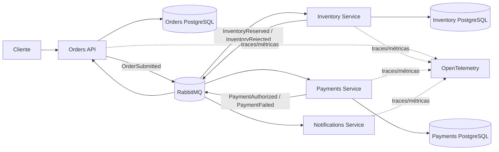

<div align="center">

[🇺🇸 English](README.en.md)

# Distributed Commerce Platform

### .NET 10 · Clean Architecture · RabbitMQ · Event-Driven Architecture

[](https://github.com/WillianZanutoOliveira/distributed-commerce-platform/actions/workflows/ci.yml)


**[Arquitetura](docs/architecture.md) · [Walkthrough técnico de 5 minutos](docs/recruiter-guide.md) · [ADRs](docs/adr) · [Kubernetes](deploy/k8s) · [CI](https://github.com/WillianZanutoOliveira/distributed-commerce-platform/actions/workflows/ci.yml)**

</div>

Plataforma de referência de comércio distribuído, construída com foco em práticas de produção para demonstrar preocupações de engenharia esperadas em posições de **Senior .NET, Tech Lead e Software Architect**.

O sistema modela um fluxo de checkout dividido entre serviços implantáveis de forma independente:

1. A **Orders API** recebe o pedido e persiste o agregado.
2. O pedido é publicado por meio de um **transactional bus outbox**.
3. O **Inventory Service** consome o pedido, toma uma decisão idempotente de reserva e publica o resultado.
4. O **Payments Service** reage a uma reserva bem-sucedida e autoriza ou rejeita o pagamento.
5. **Orders** reage de forma assíncrona ao resultado final do negócio.
6. O **Notifications Service** consome os resultados de pagamento de forma independente.

O projeto foca intencionalmente nas partes difíceis de sistemas distribuídos, em vez de trabalho de interface.

---

## Por que este projeto existe

O objetivo é tornar visível, em um portfólio público, engenharia backend de nível avançado:

- Clean Architecture e inversão de dependência;
- modelagem de domínio e invariantes de agregados;
- mensageria assíncrona com RabbitMQ;
- colaboração entre serviços orientada a eventos;
- padrões transactional outbox/inbox com MassTransit + EF Core;
- processamento idempotente de mensagens;
- consistência eventual;
- retries e isolamento de falhas;
- database-per-service;
- PostgreSQL;
- traces e métricas com OpenTelemetry;
- Docker e Docker Compose;
- health endpoints preparados para Kubernetes;
- quality gates em CI/CD;
- testes automatizados e cobertura;
- registros de decisões arquiteturais.

---

## Arquitetura



Mais detalhes: [documentação de arquitetura](docs/architecture.md) · [walkthrough técnico de 5 minutos](docs/recruiter-guide.md)

---

## Limites dos serviços

| Serviço | Responsabilidade | Persistência | Mensageria |
| --- | --- | --- | --- |
| Orders API | ciclo de vida do pedido e API voltada ao cliente | PostgreSQL | publica + consome |
| Inventory Service | decisão de reserva de estoque | PostgreSQL | consome + publica |
| Payments Service | decisão de autorização de pagamento | PostgreSQL | consome + publica |
| Notifications Service | reação independente de comunicação com cliente | demo stateless | consome |

Cada serviço com estado possui seu próprio banco de dados. Nenhum serviço lê tabelas pertencentes a outro serviço.

---

## Clean Architecture

O bounded context de **Orders** é dividido em camadas explícitas:

```text
Orders.Domain
      ↑
Orders.Application
      ↑
Orders.Infrastructure
      ↑
Orders.Api
```

O domínio não conhece EF Core, RabbitMQ nem ASP.NET Core.

A camada de aplicação depende de portas como:

- `IOrderRepository`
- `IUnitOfWork`
- `IIntegrationEventPublisher`

A infraestrutura implementa essas portas com PostgreSQL, EF Core e MassTransit.

Serviços menores, focados apenas em eventos, usam deliberadamente uma estrutura mais leve. Isso é intencional: o projeto demonstra que a arquitetura deve acompanhar a complexidade do serviço em vez de replicar camadas mecanicamente.

---

## Padrões de confiabilidade

### Transactional outbox

A Orders API usa o **Bus Outbox** do MassTransit com EF Core.

O estado do pedido e a intenção de envio da mensagem `OrderSubmitted` participam do mesmo limite de persistência. A requisição HTTP não precisa de uma transação distribuída entre PostgreSQL e RabbitMQ.

### Consumer inbox/outbox

Os consumers de Inventory, Payments e Orders usam a integração de outbox com EF Core para suportar proteção contra duplicidade e publicação confiável de mensagens de saída.

### Idempotência

Inventory e Payments persistem uma decisão única por `OrderId`, evitando reservas ou pagamentos duplicados em caso de reentrega de eventos de negócio.

### Consistência eventual

A API retorna inicialmente um pedido no estado `Pending`. Depois, de forma assíncrona, o estado passa para `Completed`, `InventoryRejected` ou `PaymentFailed`.

Essa é uma escolha arquitetural deliberada de sistema distribuído.

---

## Fluxo de eventos

```text
POST /orders
      |
      v
OrderSubmitted
      |
      v
Inventory Service
   /       \
  v         v
Reserved   Rejected
  |          |
  v          +------------------> Orders -> InventoryRejected
Payments
 /    \
v      v
Paid  Failed
 |      |
 +------+-----------------------> Orders
 |
 +------------------------------> Notifications
```

---

## Executando localmente

### Requisitos

- Docker Desktop / Docker Engine
- Docker Compose

Crie o arquivo local de segredos:

```bash
cp .env.example .env
```

Altere as senhas de exemplo e execute:

```bash
docker compose up --build
```

Endpoints:

| Componente | URL |
| --- | --- |
| Orders API | http://localhost:8081 |
| Orders health | http://localhost:8081/health |
| Inventory health | http://localhost:8082/health |
| Payments health | http://localhost:8083/health |
| Notifications health | http://localhost:8084/health |
| RabbitMQ Management | http://localhost:15672 |

Crie um pedido:

```bash
curl -X POST http://localhost:8081/orders \
  -H "Content-Type: application/json" \
  -d '{
    "customerId": "customer-001",
    "items": [
      { "sku": "NOTEBOOK-01", "quantity": 1, "unitPrice": 3499.90 }
    ]
  }'
```

Consulte o status assíncrono:

```bash
curl http://localhost:8081/orders/{order-id}
```

### Caminhos de falha para demonstração

O exemplo possui políticas determinísticas para permitir testar o fluxo distribuído sem provedores externos:

- quantidade de um item acima de **10** gera `InventoryRejected`;
- total do pedido acima de **5.000** gera `PaymentFailed`.

Essas regras são intencionalmente simples; o foco está na arquitetura ao redor delas.

---

## Observabilidade

Todos os serviços usam um building block compartilhado de OpenTelemetry com:

- `ActivitySource` para spans de trace distribuído;
- métricas customizadas de processamento de mensagens;
- exportação OTLP quando `OTEL_EXPORTER_OTLP_ENDPOINT` está configurado;
- exportação em console como fallback local.

Isso mantém a telemetria independente de fornecedor.

---

## CI/CD

O GitHub Actions valida toda mudança relevante com:

1. restore de dependências;
2. build em Release;
3. testes automatizados;
4. coleta de cobertura de código;
5. build do container de Orders;
6. build do container de Inventory;
7. build do container de Payments;
8. build do container de Notifications.

O Dependabot monitora dependências NuGet e GitHub Actions.

---

## Kubernetes

O repositório inclui exemplos de deployment orientados a Kubernetes em [deploy/k8s](deploy/k8s/README.md).

Eles demonstram:

- probes de liveness e readiness;
- requests e limits de recursos;
- separação entre ConfigMap e Secret;
- serviços escaláveis de forma independente;
- containers de aplicação stateless.

RabbitMQ e PostgreSQL são tratados como dependências de plataforma que, em produção, normalmente seriam fornecidas por serviços gerenciados ou operadores dedicados.

---

## Decisões de arquitetura

- [ADR-0001 — Serviços orientados a eventos e Clean Architecture](docs/adr/0001-event-driven-clean-architecture.md)
- [ADR-0002 — Transactional outbox em vez de transações distribuídas](docs/adr/0002-transactional-outbox.md)
- [ADR-0003 — Idempotência e consistência eventual](docs/adr/0003-idempotency-eventual-consistency.md)

---

## Estrutura do repositório

```text
src/
├── BuildingBlocks/
│   ├── Contracts/
│   └── Observability/
└── Services/
    ├── Orders/
    │   ├── Orders.Domain/
    │   ├── Orders.Application/
    │   ├── Orders.Infrastructure/
    │   └── Orders.Api/
    ├── Inventory/
    ├── Payments/
    └── Notifications/

tests/
└── Orders.Domain.Tests/

docs/
├── architecture.md
└── adr/

deploy/
└── k8s/
```

---

## Trade-offs de engenharia

Esta é uma implementação de portfólio/referência, não uma afirmação de que todo sistema deveria usar microsserviços.

Um monólito modular seria preferível para muitos produtos menores. Este projeto usa serviços distribuídos intencionalmente para tornar visíveis preocupações que aparecem quando os limites são separados: garantias de entrega, idempotência, transições assíncronas de estado, persistência independente, política de retries, saúde operacional e observabilidade.

Esse trade-off é documentado de forma explícita.
