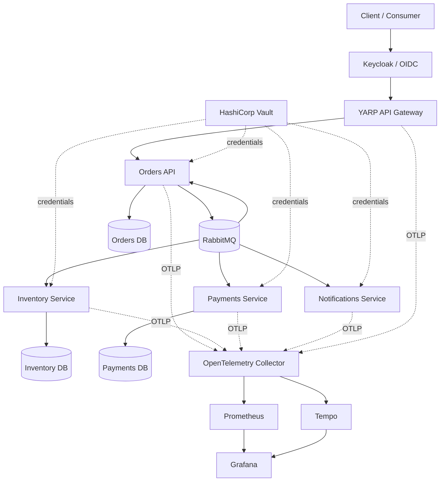
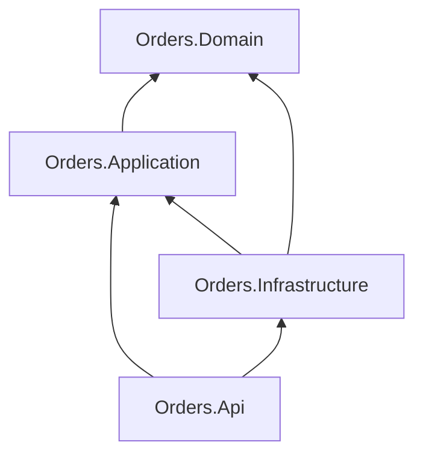

[🇧🇷 Português](architecture.md)

# Architecture

## System goal

Distributed Commerce Platform is a reference architecture for a transactional checkout journey implemented with independently deployable .NET services.

It is deliberately designed around architectural concerns that become important at senior/lead level:

- service boundaries;
- state ownership;
- asynchronous communication;
- delivery guarantees;
- transactional messaging;
- idempotency;
- eventual consistency;
- failure handling;
- observability;
- deployment independence.

## Context diagram



## Boundaries

### Orders

Orders owns the customer-facing order aggregate and is the only service that can change order lifecycle state.

It exposes synchronous HTTP commands/queries but collaborates with other bounded contexts through integration events.

### Inventory

Inventory owns reservation decisions.

It does not modify Orders data or call the Orders database. It communicates through events.

### Payments

Payments owns payment decisions.

The demo uses a deterministic rule rather than a real payment gateway so the architecture can run without credentials.

### Notifications

Notifications reacts to completed payment outcomes without becoming part of the critical transaction chain.

This demonstrates how additional capabilities can subscribe to business events without increasing coupling between core services.

## Clean Architecture dependency direction



The core domain has no reference to:

- EF Core;
- MassTransit;
- RabbitMQ;
- ASP.NET Core;
- PostgreSQL.

## Messaging topology

Integration contracts live in a small shared contracts assembly.

The shared assembly contains message schemas only. It contains no service implementation or shared database model.

Current events:

- `OrderSubmitted`
- `InventoryReserved`
- `InventoryRejected`
- `PaymentAuthorized`
- `PaymentFailed`

## Transaction boundary

Orders uses MassTransit Bus Outbox with EF Core.

```text
HTTP Request
   |
   +--> create Order aggregate
   |
   +--> publish OrderSubmitted
   |
   +--> SaveChanges()
           |
           +--> order row
           +--> outbox row
```

The broker publish happens after the database transaction is safely committed.

This avoids a two-phase distributed transaction while preserving reliable delivery.

## Consumer reliability

Stateful consumers use MassTransit EF Core inbox/outbox support together with unique business keys.

Two levels of duplicate protection exist:

1. transport/message-level inbox semantics;
2. domain-level unique `OrderId` decision records.

This is important because idempotency should not depend only on the transport implementation.

## Consistency model

The platform is eventually consistent.

Immediately after `POST /orders`, an order is `Pending`.

Later messages move it to one terminal state:

- `Completed`;
- `InventoryRejected`;
- `PaymentFailed`.

No distributed lock or cross-service SQL transaction is used.

## Failure behavior

Receive endpoints use interval-based retry.

After retry exhaustion, MassTransit moves poison messages to its error transport, isolating repeated failures from the normal queue.

The design favors:

- at-least-once delivery;
- idempotent handling;
- observable failures;
- replayability.

## Identity and authorization

Keycloak acts as the OpenID Connect Identity Provider. The YARP API Gateway validates the token at the edge and Orders validates the JWT again, avoiding trust in the proxy layer alone.

The API validates JWT issuer, audience, signature and lifetime. Business identity is derived from the token sub claim, and realm roles are used by authorization policies.

Authorization does not stop at the endpoint: order queries verify resource ownership, with an explicit bypass only for the admin role.

The local setup uses a versioned importable realm so behavior is reproducible in Docker Compose and CI.

## Secrets management

The secure profile uses HashiCorp Vault KV v2. Each workload receives an independent file-mounted token and a policy that can read only its own path. The `DistributedCommerce.Secrets` building block loads values before database and messaging composition.

Locally, the root token exists only to bootstrap Vault in dev mode. Production should prefer platform authentication such as Kubernetes Auth, with short-lived tokens, TLS, auditing and rotation. AppRole is a fallback when native platform identity is unavailable.

Service collaboration remains asynchronous through RabbitMQ; no synchronous service-to-service HTTP calls were introduced just to demonstrate OAuth. This preserves the existing architectural boundaries.

## Observability

A shared OpenTelemetry building block exposes:

- an `ActivitySource` for custom spans;
- a `Meter` for custom counters;
- message-processing metrics;
- OTLP export when configured.

The local profile includes OpenTelemetry Collector, Grafana Tempo, Prometheus and Grafana. The application code remains backend-agnostic so telemetry backends can change without coupling services to a vendor.

## Deployment model

Every service has its own Dockerfile and health endpoint.

The Kubernetes examples assume:

- independent replicas;
- service-level resource limits;
- readiness/liveness checks;
- secrets supplied outside source control;
- managed/external RabbitMQ and PostgreSQL in production.

## Intentional omissions

For portfolio clarity, the first version intentionally does not include:

- a frontend;
- a real payment provider;
- service mesh;
- Event Sourcing;
- a Kubernetes operator stack.

These can be added later, but are not required to demonstrate the distributed consistency and messaging concerns at the center of the project.
