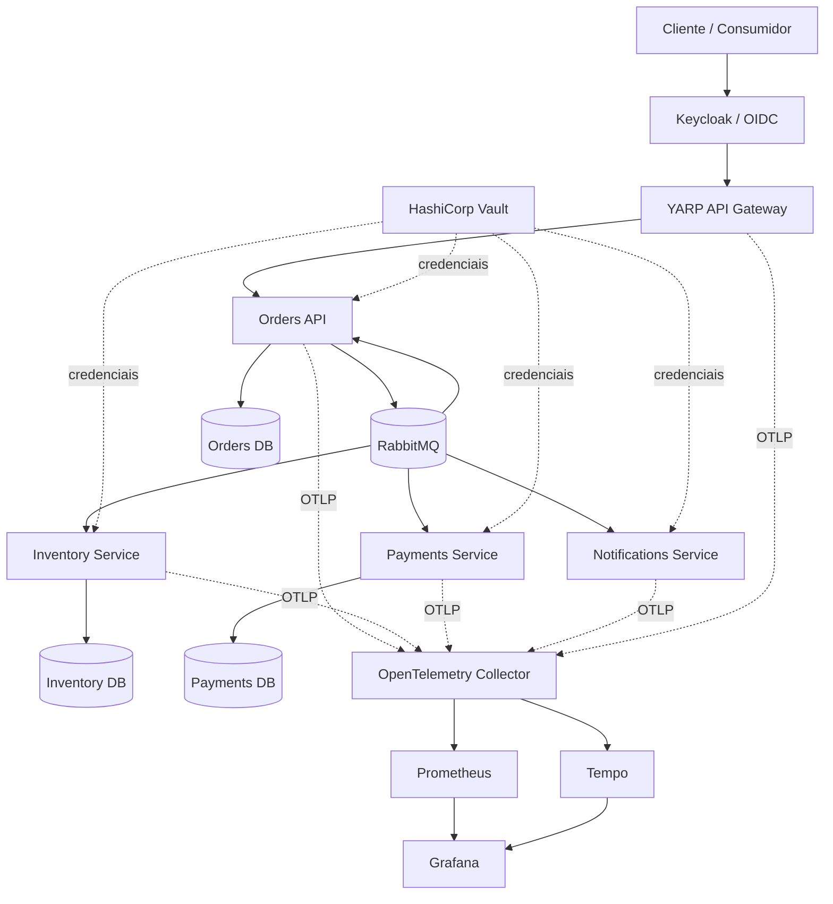
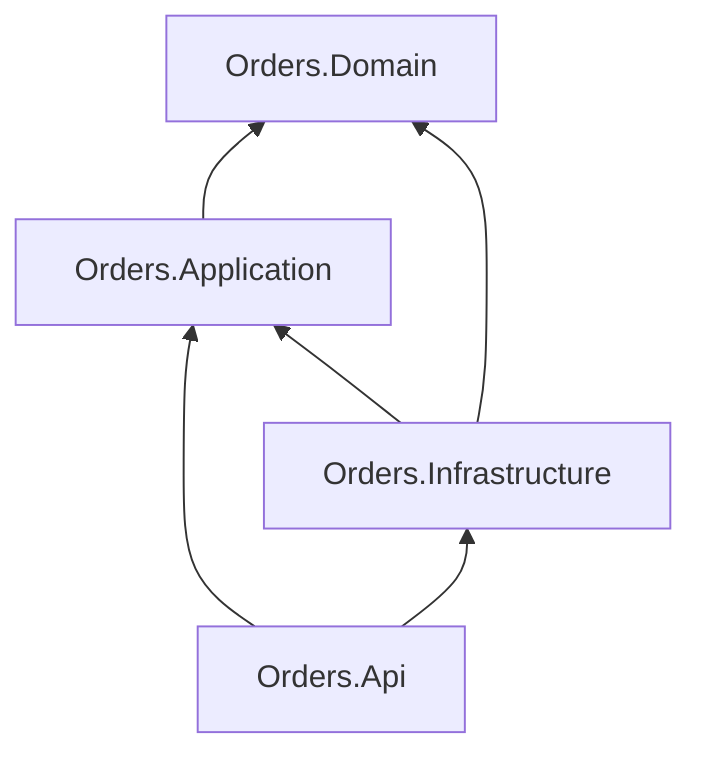

[🇺🇸 English](architecture.en.md)

# Arquitetura

## Objetivo do sistema

O Distributed Commerce Platform é uma arquitetura de referência para uma jornada transacional de checkout implementada com serviços .NET implantáveis de forma independente.

O projeto foi desenhado intencionalmente em torno de preocupações arquiteturais relevantes em nível sênior/lead:

- limites entre serviços;
- ownership de estado;
- comunicação assíncrona;
- garantias de entrega;
- mensageria transacional;
- idempotência;
- consistência eventual;
- tratamento de falhas;
- observabilidade;
- independência de deployment.

## Diagrama de contexto



## Limites

### Orders

Orders é responsável pelo agregado de pedido voltado ao cliente e é o único serviço que pode alterar o estado do ciclo de vida do pedido.

Ele expõe comandos/consultas HTTP síncronos, mas colabora com outros bounded contexts por meio de eventos de integração.

### Inventory

Inventory é responsável pelas decisões de reserva.

Ele não altera dados de Orders nem acessa o banco de Orders. A comunicação acontece por eventos.

### Payments

Payments é responsável pelas decisões de pagamento.

A demonstração usa uma regra determinística em vez de um gateway real, permitindo executar a arquitetura sem credenciais externas.

### Notifications

Notifications reage aos resultados de pagamento concluídos sem fazer parte da cadeia transacional crítica.

Isso demonstra como novas capacidades podem assinar eventos de negócio sem aumentar o acoplamento entre os serviços centrais.

## Direção de dependências na Clean Architecture



O domínio central não referencia:

- EF Core;
- MassTransit;
- RabbitMQ;
- ASP.NET Core;
- PostgreSQL.

## Topologia de mensageria

Os contratos de integração ficam em um assembly compartilhado pequeno.

Esse assembly contém apenas schemas de mensagens. Ele não contém implementação de serviços nem modelo compartilhado de banco de dados.

Eventos atuais:

- `OrderSubmitted`
- `InventoryReserved`
- `InventoryRejected`
- `PaymentAuthorized`
- `PaymentFailed`

## Limite transacional

Orders usa o Bus Outbox do MassTransit com EF Core.

```text
HTTP Request
   |
   +--> cria o agregado Order
   |
   +--> publica OrderSubmitted
   |
   +--> SaveChanges()
           |
           +--> linha do pedido
           +--> linha da outbox
```

A publicação no broker acontece após o commit seguro da transação no banco de dados.

Isso evita uma transação distribuída em duas fases sem abrir mão da entrega confiável.

## Confiabilidade dos consumers

Consumers com estado usam suporte inbox/outbox do MassTransit com EF Core em conjunto com chaves de negócio únicas.

Existem dois níveis de proteção contra duplicidade:

1. semântica de inbox no nível de transporte/mensagem;
2. registros únicos de decisão por `OrderId` no nível de domínio.

Isso é importante porque a idempotência não deve depender somente da implementação de transporte.

## Modelo de consistência

A plataforma é eventualmente consistente.

Logo após `POST /orders`, um pedido está em `Pending`.

Mensagens posteriores movem o pedido para um estado terminal:

- `Completed`;
- `InventoryRejected`;
- `PaymentFailed`.

Não há lock distribuído nem transação SQL entre serviços.

## Comportamento de falhas

Os receive endpoints usam retry baseado em intervalo.

Após esgotar as tentativas, o MassTransit move mensagens problemáticas para o transporte de erro, isolando falhas repetidas da fila normal.

O design prioriza:

- entrega at-least-once;
- processamento idempotente;
- falhas observáveis;
- possibilidade de replay.

## Identidade e autorização

Keycloak atua como Identity Provider OpenID Connect. O YARP API Gateway valida o token na borda e a Orders API valida novamente o JWT, evitando confiar apenas na camada de proxy.

A API valida JWT com emissor, audiência, assinatura e tempo de vida. A identidade de negócio é derivada da claim sub, e roles do realm são usadas em policies de autorização.

A autorização não termina no endpoint: consultas de pedido verificam ownership do recurso, com bypass explícito apenas para a role admin.

A configuração local usa um realm importável e versionado para tornar o comportamento reproduzível em Docker Compose e CI.

## Gestão de segredos

O perfil seguro usa HashiCorp Vault com dois mecanismos. KV v2 armazena os segredos estáticos restantes do demo, enquanto o Database Secrets Engine emite credenciais PostgreSQL dinâmicas para Orders, Inventory e Payments.

Cada workload recebe um token independente por arquivo montado. Para banco, o token só pode ler `database/creds/<service>-app` e renovar leases sob o mesmo prefixo. A resposta do Vault fornece `username`, `password`, `lease_id`, TTL e `renewable`; o connection string é construído somente em memória.

### Roles estáveis e logins efêmeros

Cada banco possui uma role `NOLOGIN` estável (`orders_runtime`, `inventory_runtime`, `payments_runtime`). O Vault cria um login efêmero e concede membership somente nessa role. A sessão PostgreSQL faz `SET ROLE` via connection options, separando a identidade temporária da autorização persistente.

O lease é renovado em background. Se a renovação falhar, o host encerra o processo para que o orquestrador force uma nova autenticação e uma nova credencial.

No ambiente local, o root token existe apenas para bootstrap do Vault em modo dev. Em produção, a preferência é autenticação de plataforma, como Kubernetes Auth, com tokens curtos, TLS, auditoria e rotação. AppRole é tratado como fallback quando identidade nativa da plataforma não está disponível.

A comunicação entre serviços continua assíncrona por RabbitMQ; não foram introduzidas chamadas HTTP service-to-service apenas para demonstrar OAuth. O lifecycle das credenciais PostgreSQL está detalhado no [ADR-0007](adr/0007-dynamic-postgresql-credentials.md). Isso preserva os limites arquiteturais já existentes.

## Orquestração de desenvolvimento local com Aspire

O AppHost em `src/Platform/DistributedCommerce.AppHost` modela a topologia local sem alterar os limites arquiteturais do sistema.

```text
Aspire AppHost
├── Infrastructure containers
│   ├── Keycloak
│   ├── Vault
│   ├── vault-init
│   ├── RabbitMQ
│   ├── Orders PostgreSQL
│   ├── Inventory PostgreSQL
│   └── Payments PostgreSQL
│
└── Local .NET projects
    ├── YARP API Gateway
    ├── Orders API
    ├── Inventory
    ├── Payments
    └── Notifications
```

A escolha de executar os workloads .NET como projetos locais melhora o inner loop: breakpoints, recompilação incremental, logs por recurso e telemetria aparecem no Aspire Dashboard. Dependências externas continuam containerizadas.

A simplificação é somente operacional. O AppHost preserva:

- autenticação Keycloak;
- boundary YARP → Orders;
- RabbitMQ;
- Vault KV v2;
- Vault Database Secrets Engine;
- login PostgreSQL temporário por workload;
- lease renewal e fail closed;
- database-per-service.

O Docker Compose seguro continua sendo o modelo de paridade usado pelo CI e a alternativa para executar toda a aplicação em containers. O Aspire AppHost é uma ferramenta de desenvolvimento, não a definição da arquitetura de implantação em produção.

Veja [ADR-0008](adr/0008-dotnet-aspire-local-orchestration.md) e o [guia de desenvolvimento local](local-development.md).

## Observabilidade

Um building block compartilhado de OpenTelemetry expõe:

- `ActivitySource` para spans customizados;
- `Meter` para contadores customizados;
- métricas de processamento de mensagens;
- exportação OTLP quando configurada.

O perfil local inclui OpenTelemetry Collector, Grafana Tempo, Prometheus e Grafana. O código continua backend-agnostic: trocar o backend não exige acoplar os serviços a um fornecedor.

## Modelo de deployment

Cada serviço possui seu próprio Dockerfile e health endpoint.

Os exemplos de Kubernetes assumem:

- réplicas independentes;
- limites de recursos por serviço;
- checks de readiness/liveness;
- segredos fornecidos fora do controle de versão;
- RabbitMQ e PostgreSQL gerenciados/externos em produção.

## Omissões intencionais

Para manter clareza de portfólio, a primeira versão intencionalmente não inclui:

- frontend;
- provedor real de pagamentos;
- service mesh;
- Event Sourcing;
- stack de operadores Kubernetes.

Esses itens podem ser adicionados no futuro, mas não são necessários para demonstrar as preocupações de consistência distribuída e mensageria que estão no centro do projeto.
